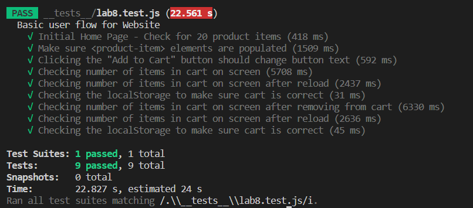
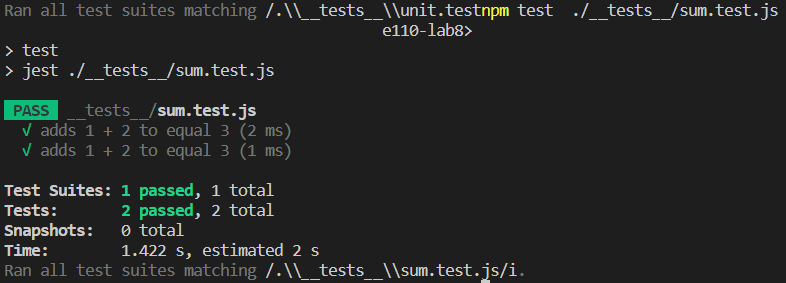
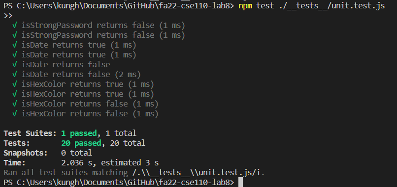

# Lab 8 - Starter
Created by Harrison Kung

1. Where would you fit your automated tests in your Recipe project development pipeline? Select one of the following and explain why.
    - Within a Github actino that runs whenever code is published, to help with
    automation and to make tests consistently run for all developers.
2. Would you use an end to end test to check if a function is returning the correct output? (yes/no)
    - No, a function is only a small part of the program, and a full end-to-end test
    would be too slow and too expensive to run for every function.
3. Would you use a unit test to test the “message” feature of a messaging application? Why or why not? For this question, assume the “message” feature allows a user to write and send a message to another user.
    - No, a unit test would not be able to test the message feature, as it would
    require a user to send a message to another user, which is not possible in a
    unit test.
4. Would you use a unit test to test the “max message length” feature of a messaging application? Why or why not? For this question, assume the “max message length” feature prevents the user from typing more than 80 characters.
    - Yes, a unit test would be able to test the max message length feature, as it
    would only require the user to type more than 80 characters, which is possible
    in a unit test.

